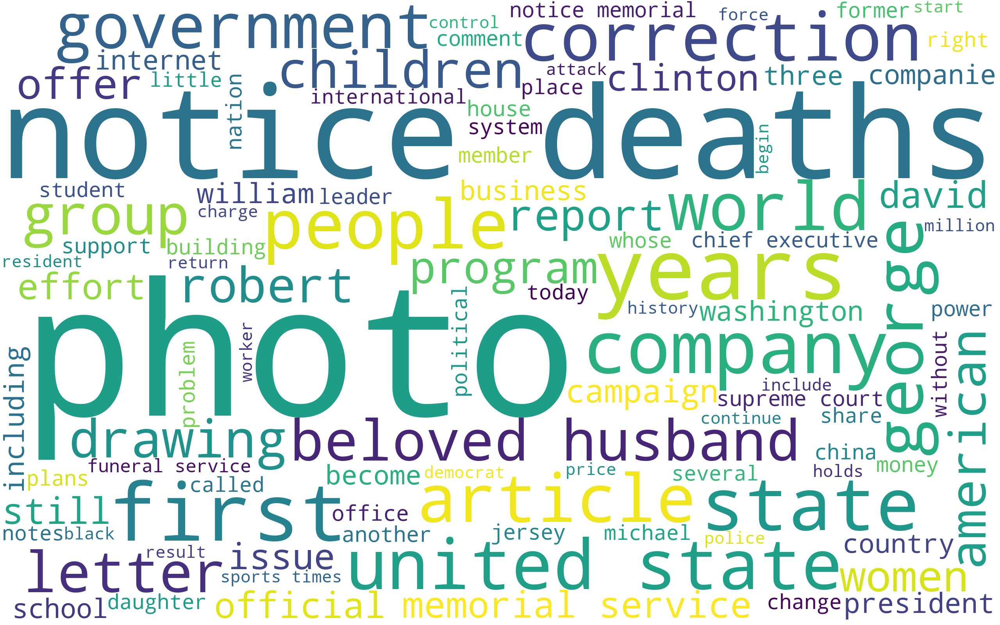

# dsc106-sp21-hw-group-bubbletea

UCSD DSC 106 SP21 Project by Jasmine Guan and Sheng Yang

## Overview

Music has been a channel for artists to express social sentiments for long, but how are they correlated in effect? In this data visualization project, we are interested in **exploring the correlation between music timbre and news sentiment from 1920-2020**.  

## Dependencies

Please pip install the **latest** versions of following python packages:
`Altair`
`NLTK`
`WordCloud`

## Data Source

- **Timbre Features**: [Audio features of songs ranging from 1922 to 2011](https://www.kaggle.com/uciml/msd-audio-features?select=year_prediction.csv);
- **News Sentiment**: [New York Times Articles 1920-2020](https://www.kaggle.com/tumanovalexander/nyt-articles-data).

## Citation

- **EchoNest Data Digestion**: [Analyzer Documentation](http://modelai.gettysburg.edu/2012/music/docs/EchoNestAnalyzeDocumentation.pdf)

Some examples include: 
| Timbre Basis    | Explanation |
| ----------- | ----------- |
| TimbreAvg1  | average loudness of the segment  |
| TimbreAvg2  | brightness |
| TimbreAvg3  | more closely correlated to the flatness of a sound |
| TimbreAvg4  | stronger attack |

- **WordCloud Tutorial**: [Generating WordClouds in Python](https://www.datacamp.com/community/tutorials/wordcloud-python)
- **NLTK Tutorial**: [Sentiment Analysis: First Steps With Python's NLTK Library](https://realpython.com/python-nltk-sentiment-analysis/)
- **Correlation Plot with Chained Selection**: [Altair plot deconstruction: visualizing the correlation structure of weather data](https://towardsdatascience.com/altair-plot-deconstruction-visualizing-the-correlation-structure-of-weather-data-38fb5668c5b1)

Example: Word Cloud in year 2000 

### For developer references

- **Color Schemes**: [Available Color Schemes](https://vega.github.io/vega/docs/schemes/#reference)

TODO: add photos to attract people to take a look.
