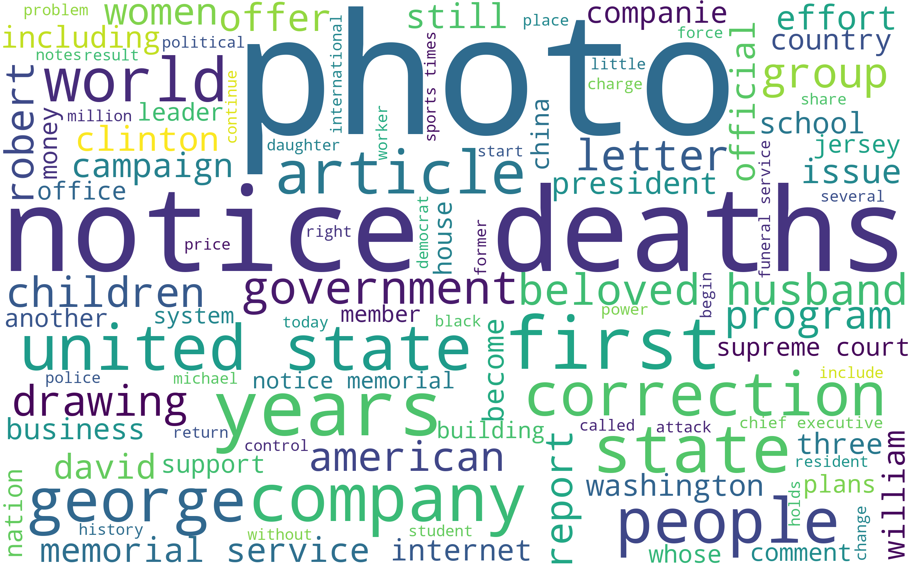

# dsc106-sp21-hw-group-bubbletea

UCSD DSC 106 SP21 Project by Jasmine Guan and Sheng Yang

## Overview

Music has been a channel for artists to express social sentiments for long, but how are they correlated in effect?

In this data visualization project, we are interested in **exploring the correlation between music timbre and news sentiment from 1920-2020**. In particular, we are interested in answering the following two questions:

1. How strong/weak a correlation do we have between music timbre and different sentiments? For example, could we expect a period with more negative sentiments expressed to have music characterized by a flatter timbre?  
2. Does the correlation change overtime? If the correlation is strong, is it strong consistently across the entire 90 years?  

The following is a quick demo of the final data visualization. If you are interested in how this plot is made and how conclusions are derived to answer the questions above, please read the following for more detailed explanation.

## Dependencies

Please pip install the **latest** versions of following python packages:
`Altair`
`NLTK`
`WordCloud`

## Data Source

- **Timbre Features**: [Audio features of songs ranging from 1922 to 2011](https://www.kaggle.com/uciml/msd-audio-features?select=year_prediction.csv);
- **News Sentiment**: [New York Times Articles 1920-2020](https://www.kaggle.com/tumanovalexander/nyt-articles-data).

## File Digestion

- **report.html**: directly read our report. For the purpose of submission, one may only examine this file.
- **report**: store images for presentation and report
- **report.ipynb**: final report
  - containing introduction, our hypothesis, exploratory data analysis, important visualizations, observations and conclusions
- **project-eda.ipynb**: a scratch space for EDA. All things to be shown are included in **report.ipynb** instead.
- **data**:
  - year_prediction.csv: data for Timbre analysis
  - archive: NYT article titles from 1920 to 2020
- **preprocess**: filtered and reconstructed datasets for easier **manipulation**
  - df_1920_sample.csv: can explore natural language processing with this file
  - nltk_scores_by_year.csv: pre-computed annual nltk scores
  - timbre_avg_by_decade.csv: grouped timbre observations into decades and computed average
  - timbre_avg_by_year.csv: grouped timbre observations into years and computed average
- **preprocess.py**: how emotion/sentiment prepared for each year
  - how preprocessed data are obtained from downloaded dataset
  - running this file is not mandatory
- **util.py**: necessary auxiliary functions to load, process, and plot data
  - plot word clouds
  - transform temporal data to datetime objects
  - plot correlation between Timbre and Sentiment
  - plot ridgeline
  - final visualization

## Citation

- **EchoNest Data Digestion**: [Analyzer Documentation](http://modelai.gettysburg.edu/2012/music/docs/EchoNestAnalyzeDocumentation.pdf)

Some examples include:
| Timbre Basis    | Explanation |
| ----------- | ----------- |
| TimbreAvg1  | average loudness of the segment  |
| TimbreAvg2  | brightness |
| TimbreAvg3  | more closely correlated to the flatness of a sound |
| TimbreAvg4  | stronger attack |

- **WordCloud Tutorial**: [Generating WordClouds in Python](https://www.datacamp.com/community/tutorials/wordcloud-python)
- **NLTK Tutorial**: [Sentiment Analysis: First Steps With Python's NLTK Library](https://realpython.com/python-nltk-sentiment-analysis/)
- **Correlation Plot with Chained Selection**: [Altair plot deconstruction: visualizing the correlation structure of weather data](https://towardsdatascience.com/altair-plot-deconstruction-visualizing-the-correlation-structure-of-weather-data-38fb5668c5b1)

Example: Word Cloud in year 2000 

### For developer references

- **Color Schemes**: [Available Color Schemes](https://vega.github.io/vega/docs/schemes/#reference)
